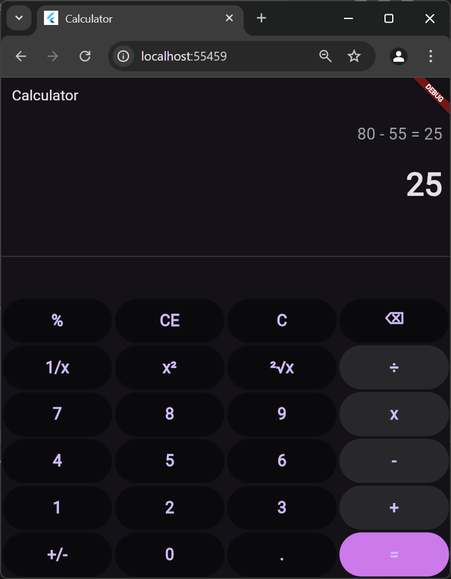

# Calculator App



This is a simple calculator app built with Flutter.

## Getting Started

To get started with this project, follow these steps:

1. **Clone the repository**:
   ```sh
   git clone https://github.com/yourusername/calculator_app.git
   cd calculator_app